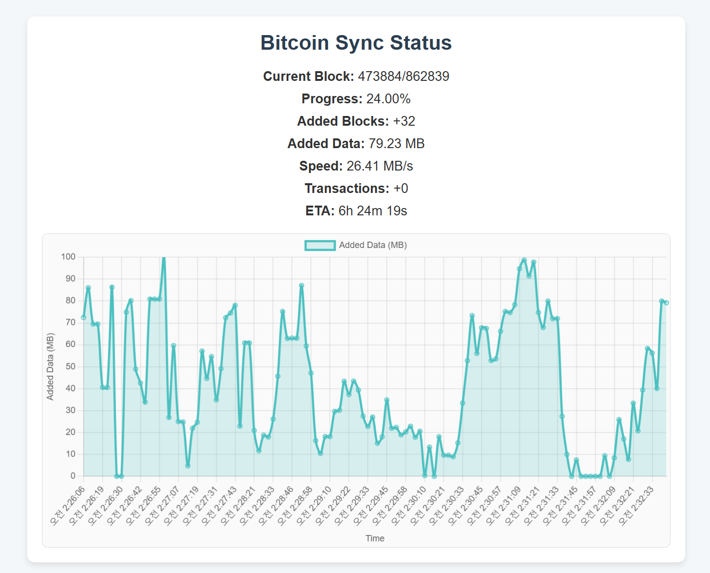

#bitcoin_server

## 개요
`Flask`, `Node.js`, `Express.js`, `HTML`, `CSS` 를 사용하여 비트코인 동기화 상태를 실시간 웹 페이지로 만들어 보자

## 환경설정
```bash
### Node.js
sudo apt update
sudo apt install nodejs
sudo apt install npm

### 필요한 패키지 설치
npm install express axios

### 웹 서비스 실행
node server.js
python3 bitcon_sync_monitor.py
```
